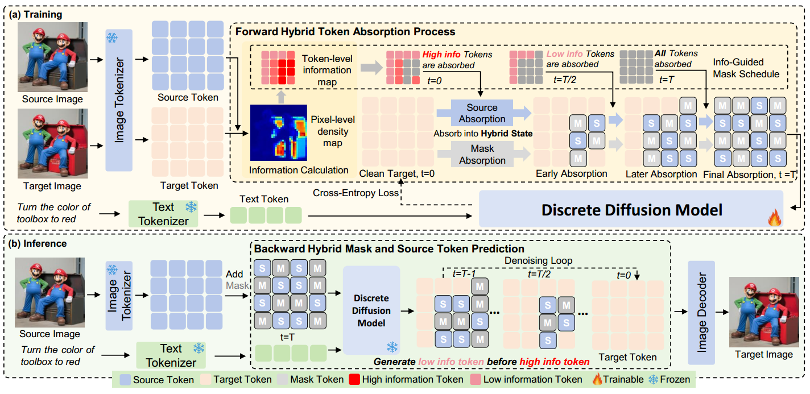
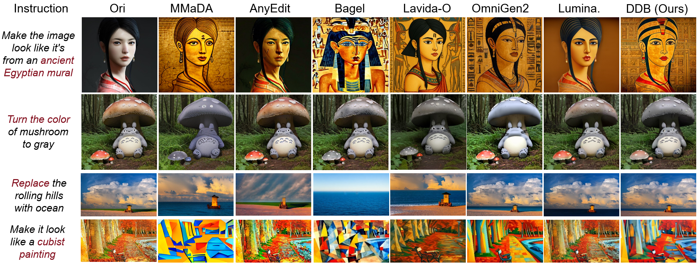
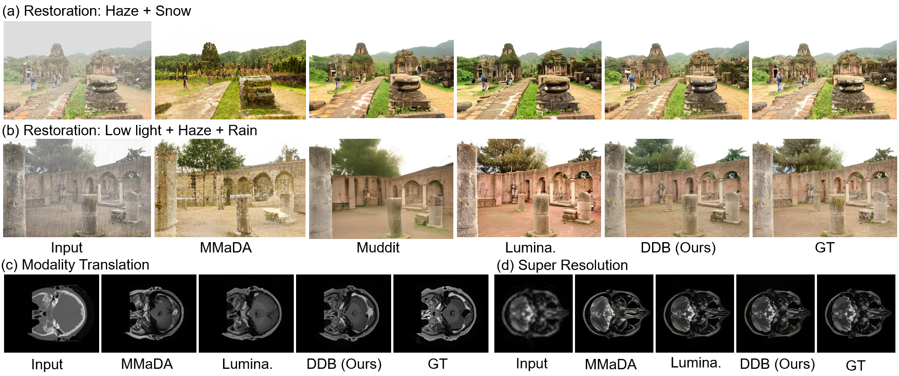
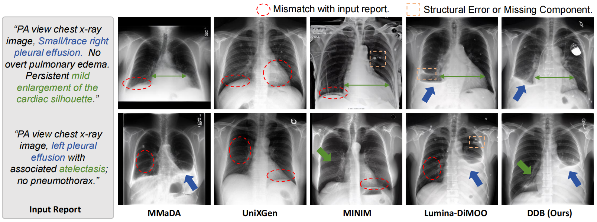

# Discrete Diffusion Bridges for Spatiotemporally Aligned Image Translation and Generation | ECCV 2026

<div align="center">

[📄 arXiv]() &nbsp;|&nbsp; [🤗 DDB_Edit](https://huggingface.co/xing0916/DDB_Edit)

</div>

## 🌟 Overview

**DDB** (Discrete Diffusion Bridges) is a framework for spatially and temporally aligned image translation and generation. It introduces:

- A **hybrid absorption mechanism** that mixes source-image and mask tokens, preserving source structure as spatial anchors.
- An **information-guided noise schedule** that aligns training corruption with the easy-first decoding process used at inference time.

DDB supports text-guided image editing, structural image translation, and text-to-image generation.

### Framework



### Results

#### Text-Guided Image-to-Image Editing (TI2I)



#### Image-to-Image Translation (I2I)



#### Text-to-Image Generation (T2I)



## ⛽ Installation

```bash
conda create -n ddb python=3.10 -y
conda activate ddb
pip install -r requirements.txt
```

## 🚀 Demo

Download [DDB_Edit](https://huggingface.co/xing0916/DDB_Edit), place it under `checkpoints/DDB_Edit`, and prepare an editing sample in `data/edit_demo.jsonl`:

```json
{"omni_edit_id":"demo-001","input_image_path":"data/source.png","target_image_path":"demo-output.png","text":["Add a small red flower to the table."]}
```

Run image editing with:

```bash
python inference/eval_omni_benchmarrk_source.py \
    --checkpoint checkpoints/DDB_Edit \
    --vae_ckpt Alpha-VLLM/Lumina-DiMOO \
    --input_jsonl data/edit_demo.jsonl
```

Generated images and source/output comparisons are saved under the checkpoint directory.

## ⚡ Training

Prepare editing pairs in JSON or JSONL format:

```json
{"image_path":"data/source.png","edit_path":"data/target.png","prompt":"Add a small red flower to the table."}
```

Pre-tokenize the editing data:

```bash
python pre_tokenizer/pre_tokenize.py \
    --splits 1 \
    --rank 0 \
    --in_filename data/edit_train.jsonl \
    --out_dir pre_token/edit_train \
    --type edit \
    --target_size 512

python pre_tokenizer/concat_record.py \
    --sub_record_dir pre_token/edit_train \
    --save_path pre_token/edit_train/all_records.json
```

Create an editing data config, for example `configs/data_editing.yaml`:

```yaml
META:
  - path: pre_token/edit_train/all_records.json
```

Set `init_from` and `data_config` in `train/train.sh`, then launch training:

```bash
bash train/train.sh
```

## 🙏 Acknowledgement

This project is built upon [Lumina-DiMOO](https://github.com/Alpha-VLLM/Lumina-DiMOO). We thank the authors for releasing their code and models.
